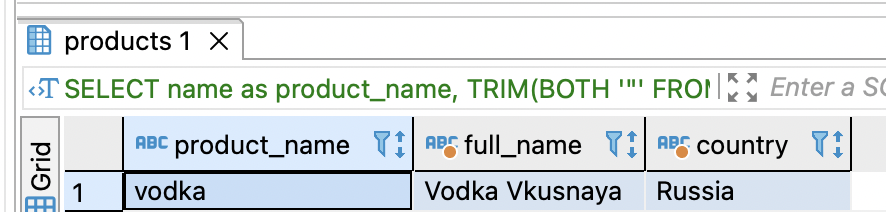

**Домашняя работа №10: Типы данных**

- проанализировать типы данных в своем проекте, изменить при необходимости. В README указать что на что поменялось и почему.

Все id поменял с типа bigint на integer, так как предполагается число записей, для которого intrger будет достаточно. Память экономится примерно в 2 раза.

- добавить тип JSON в структуру. Проанализировать какие данные могли бы там хранится. привести примеры SQL для добавления записей и выборки.

Добавил поле meta_data в таблицу products. В данном атрибуте может содержаться мета информация о продукте. 

Например:

```
{
   "product":"Vodka Vkusnaya",
   "made_in":"Russia",
   "is_adult":true,
   "is_not_for_children":true
}
```

Добавим одну запись в БД.

```
INSERT INTO products  (name, meta_data)
VALUES 
('vodka', 
'{
   "product":"Vodka Vkusnaya",
   "made_in":"Russia",
   "is_adult":true,
   "is_not_for_children":true
}');
```

Теперь сделаем выборку

```
SELECT 
	name as product_name,
	TRIM(BOTH '"' FROM JSON_EXTRACT(meta_data, '$.product')) as full_name,
	TRIM(BOTH '"' FROM JSON_EXTRACT(meta_data, '$.made_in')) as country
FROM products p 
WHERE JSON_EXTRACT(meta_data, '$.is_adult') = TRUE;
```


