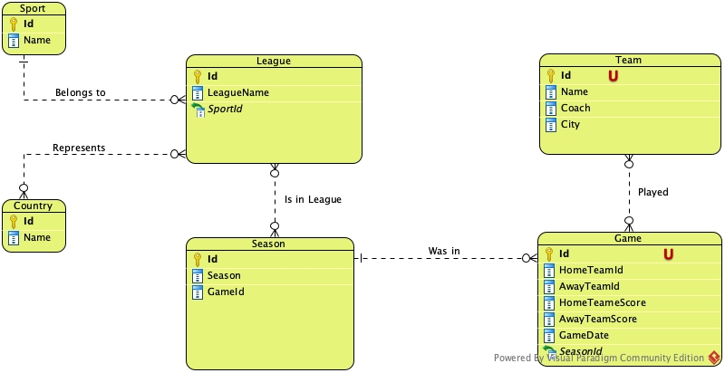

**Домашнее задание №11: SQL выборка**

Так как дипломный проект будет не он-лайн магазин, а БД для сервиса спортивной статистики и аналитики, то запросы буду делать к этой БД. Чтобы испавить ошибки до диплома.

Вот примерный концепт


- Напишите запрос по своей базе с inner join

```
/*
показать результаты всех команд в домашних матчах в сезоне 22/23,
так как это INNER JOIN, то результаты команд, ещё не игравших дома, показаны не будут
*/

SELECT 
	t.name, 
	t.coach, 
	t.city, 
	CONCAT(CAST(g.home_team_score as VARCHAR(2)), ' : ', CAST(g.away_team_score as VARCHAR(2))) as total_score
FROM teams t
INNER JOIN games g
ON t.id = g.home_team_id 
AND g.season_id IN (SELECT id FROM season WHERE season = '2022/23')
```

- Напишите запрос по своей базе с left join
```
/*
Выбрать все сыгранные сезоны для всех профессиональных североамериканских лиг. Если сезон не был проведён (коронавирус, локдаун, форс-мажор, лига образована позднее других), то такой сезон будет со значением NULL
*/


SELECT l.name, s.season
FROM league l
LEFT JOIN season s
ON l.id = s.league_id and l.name IN ('NHL', 'MLB', 'NFL', 'NBA', 'MLS')
```

- Напишите 5 запросов с WHERE с использованием разных операторов, опишите для чего вам в проекте нужна такая выборка данных

```
/*
создадим табличное выражение, чтобы удобнее было делать запросы. версия mysql 8+.
для этого при помощи UNION объединим выборку по домашним и гостевым командам
*/

WITH results AS (
SELECT 
	t.name as team_name, 
	t.coach, 
	t.city, 
	s1.home_team_score as team_score, 
	s1.away_team_score as opponent_score,
	s1.game_date
FROM team t
INNER JOIN season s1
ON t.id = s1.home_team_id
UNION
SELECT 
	t.name, 
	t.coach, 
	t.city,
	s2.away_team_score as team_score,
	s2.home_team_score as opponent_score, 
	s2.game_date
FROM team t
LEFT JOIN season s2
ON t.id = s2.away_team_id
)

-- выберем результаты всех московских команд во всех лигах и видах спорта

SELECT *
FROM results
WHERE city = 'Moscow'

-- выберем результаты всех московских команд, в которых они не проиграли

SELECT *
FROM results
WHERE city = 'Moscow'
AND team_score >= opponent_score

-- выберем все ничьи осенью

SELECT *
FROM results
WHERE team_score == opponent_score
AND MONTH(game_date) IN (9, 10, 11) 

-- выберем все игры, в которых гости победили весной

SELECT *
FROM results
WHERE team_score < opponent_score
AND MONTH(game_date) IN (3, 4, 5) 

/*
выберем все игры, в которых тренеровал человек по имени Станислав Черчесов. Предполагаем, что строки в БД обработаны и нормализованы
*/

SELECT * from
results where coach = 'Stanislav Cherchesov'
```
