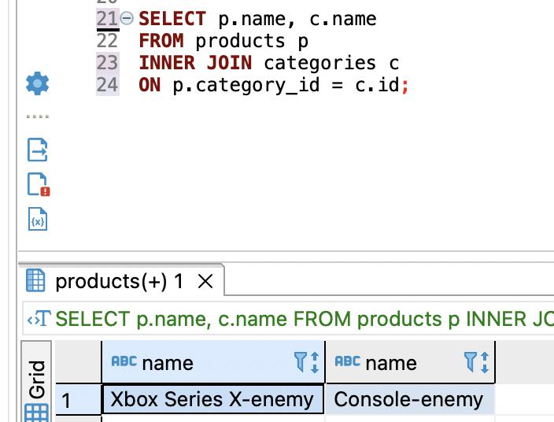
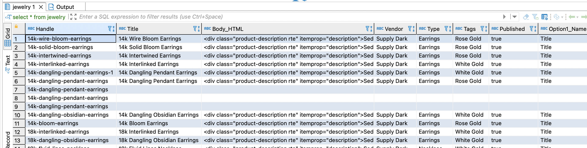
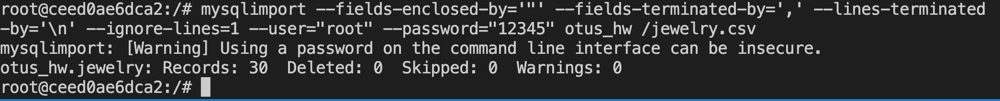

**Домашнее задание №12: Транзакции**

- Описать пример транзакции из своего проекта с изменением данных в нескольких таблицах. Реализовать в виде хранимой процедуры.

Придумаем бизнес-правило:

*Предположим, что в РФ приняли закон, по которому товары и категории из некоторых стран принято маркировать с добавлением специального суфикса. Так, консоль Xbox и категория, к которой она принадлежит должны помечаться специальным словом*

```
-- добавим данные

INSERT INTO prices (price) VALUES (32000);
INSERT INTO categories (name) VALUES ('Console');
INSERT INTO products(name, price_id, category_id) VALUES ('Xbox Series X', 1, 1);

-- создадим поцедуру

CREATE procedure enemy_marker(IN p_id int, IN c_id int, IN enemy_flag char(5))
BEGIN
  start transaction;
      UPDATE categories
      SET name = CONCAT(name, '-', enemy_flag) WHERE id = c_id;
      UPDATE products
      SET name = CONCAT(name, '-', enemy_flag) WHERE id = p_id;
  commit;   
END 

call enemy_marker(2, 1, 'enemy');
```


- Загрузить данные из приложенных в материалах csv.
	
	Реализовать следующими путями:
	
	- LOAD DATA
	для того, чтобы можно было использовать csv, добавил в my.cnf
	```
    secure-file-priv=/
	```
	Затем, закинул в контейнер csv файл.
	```
    docker cp jewelry.csv ceed0ae6dca2:/jewelry.csv
	```

	Потом создал таблицу в БД.
	```
	CREATE TABLE jewelry (
  Handle varchar(100),
  Title varchar(100),
  Body_HTML text,
  Vendor varchar(100),
  Type varchar(100),
  Tags varchar(100),
  Published varchar(100),
  Option1_Name varchar(100),
  Option1_Value varchar(100),
  Option2_Name varchar(100),
  Option2_Value varchar(100),
  Option3_Name varchar(100),
  Option3_Value varchar(100),
  Variant_SKU varchar(100),
  Variant_Grams varchar(100),
  Variant_Inventory_Tracker varchar(100),
  Variant_Inventory_Qty varchar(100),
  Variant_Inventory_Policy varchar(1000),
  Variant_Fulfillment_Service varchar(1000),
  Variant_Price varchar(1000),
  Variant_Compare_At_Price varchar(100),
  Variant_Requires_Shipping varchar(1000),
  Variant_Taxable varchar(1000),
  Variant_Barcode varchar(1000),
  Image_Src varchar(1000),
  Image_Alt_Text varchar(1000),
  Gift_Card varchar(1000),
  SEO_Title varchar(100),
  SEO_Description varchar(1000),
  Google_Shopping_Google_Product_Category varchar(100),
  Google_Shopping_Gender varchar(100),
  Google_Shopping_Age_Group varchar(100),
  Google_Shopping_MPN varchar(100),
  Google_Shopping_AdWords_Grouping varchar(100),
  Google_Shopping_AdWords_Labels varchar(100),
  Google_Shopping_Condition varchar(100),
  Google_Shopping_Custom_Product varchar(100),
  Google_Shopping_Custom_Label_0 varchar(100),
  Google_Shopping_Custom_Label_1 varchar(100),
  Google_Shopping_Custom_Label_2 varchar(100),
  Google_Shopping_Custom_Label_3 varchar(100),
  Google_Shopping_Custom_Label_4 varchar(100),
  Variant_Image varchar(1000),
  Variant_Weight_Unit varchar(100));
	```
И затем загрузил csv в таблицу.

	```
    LOAD DATA INFILE '/jewelry.csv'
	INTO TABLE jewelry 
	FIELDS TERMINATED BY ','
	ENCLOSED BY '"'
	LINES TERMINATED BY '\n'
	IGNORE 1 ROWS;
	```

	- mysqlimport

Зашёл в контейнер от рута и выполнил команду по вставки данных из csv.

	
    docker exec -it ceed0ae6dca2 /bin/bash


	mysqlimport --fields-enclosed-by='"' --fields-terminated-by=',' --lines-terminated-by='\n' --ignore-lines=1 --user="root" --password="12345" otus_hw /jewelry.csv
	


