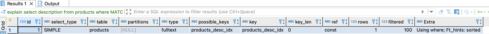
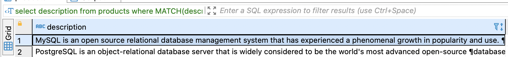

**Домашняя работа №14: Индексы**

сделать полнотекстовый индекс, который ищет по свойствам, названию товара и описанию. Если нет аналогичной задачи в проекте - имитируем

Поскольку в проекте нет полнотекстового индекса, то буду имитировать. На мой взгляд, самым логичным текстовым полем было бы описание продукта. 

Добавим поле description и немного данных туда, а также сделаем полнотекстовый поиск. Данные будут три книги (по питону, по mysql и по postgres) и описание этих книг. 

```
-- добавим поле в таблицу
ALTER TABLE products 
ADD COLUMN description TEXT;

-- добавим данные в таблицу
INSERT INTO products (name, description)
VALUES
('fluent python', 
'Python’s simplicity lets you become productive quickly, but this often means you aren’t using everything 
it has to offer. With this hands-on guide, you’ll learn how to write effective, idiomatic Python code by leveraging 
its best—and possibly most neglected—features. Author Luciano Ramalho takes you through Python’s core language 
features and libraries, and shows you how to make your code shorter, faster, and more readable at the same time.

Many experienced programmers try to bend Python to fit patterns they learned from other languages, and never 
discover Python features outside of their experience. With this book, those Python programmers will thoroughly 
learn how to become proficient in Python 3.'),
('MySQL', 
'MySQL is an open source relational database management system that has experienced a phenomenal growth in popularity and use. 
Known for its speed and ease of use, MySQL has proven itself to be particularly well-suited for developing database-backed 
websites and applications. In MySQL, Paul DuBois provides a comprehensive guide to using and administering MySQL effectively 
and productively. He describes everything from the basics of getting information into a database and formulating queries, 
to using MySQL with PHP or Perl to generate dynamic web pages, to writing your own programs that access MySQL databases, 
to administering MySQL servers.'),
('Postgresql: Developer\'s Handbook', 
'PostgreSQL is an object-relational database server that is widely considered to be the world\'s most advanced open-source 
database system. It is ANSI SQL-compatible, and it offers powerful features to enable more complex software design than would 
be possible with relational databases that are not object-oriented. PostgreSQL is extremely modular, it supports a large number 
of datatypes, and programming interfaces for PostgreSQL are available for all important programming languages, 
including C, Perl, Python, Tcl, Java, and PHP. PostgreSQL Developer\'s Handbook provides a complete overview 
of the PostgreSQL database server and extensive coverage of its core features, including object orientation, PL/pgSQL, and 
the most important programming interfaces. The book introduces the reader to the language and syntax of PostgreSQL 
and then moves quickly into advanced programming topics.');

-- создадим полнотекстовый индекс
CREATE FULLTEXT INDEX products_desc_idx ON products(description);
```

Теперь сделаем выборку. Интересно, сколько из трёх записей содердит слово *database*? У меня есть предположение, что две записи, но и в описании к книге по питону также может быть упомянуто данное слово. 

```
select description from products where MATCH(description) AGAINST ('database');
```

