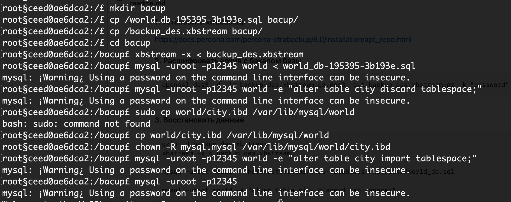
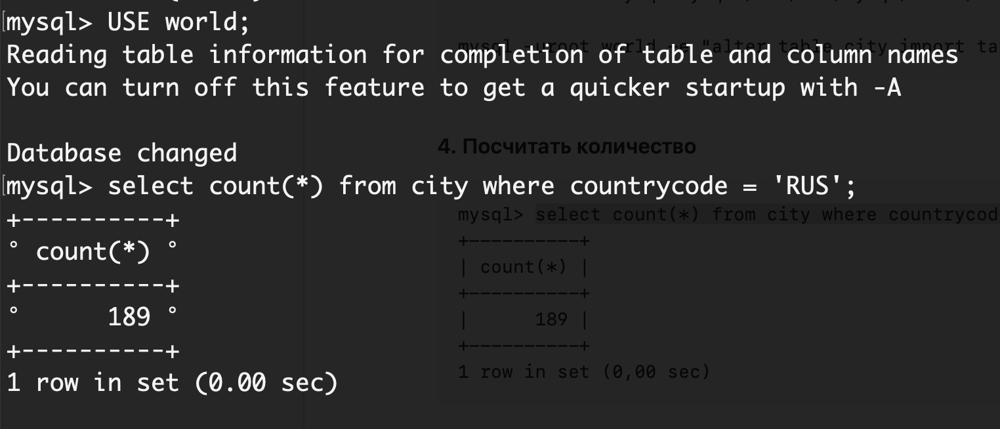

**Домашнее задание №16: Восстановить таблицу из бэкапа**

Ставим утилиту для бэкапа в доккер контейнер.
Закидываем туда файлы для восстановления.  

И затем внутри контейнера восстанавливаем базу. 

