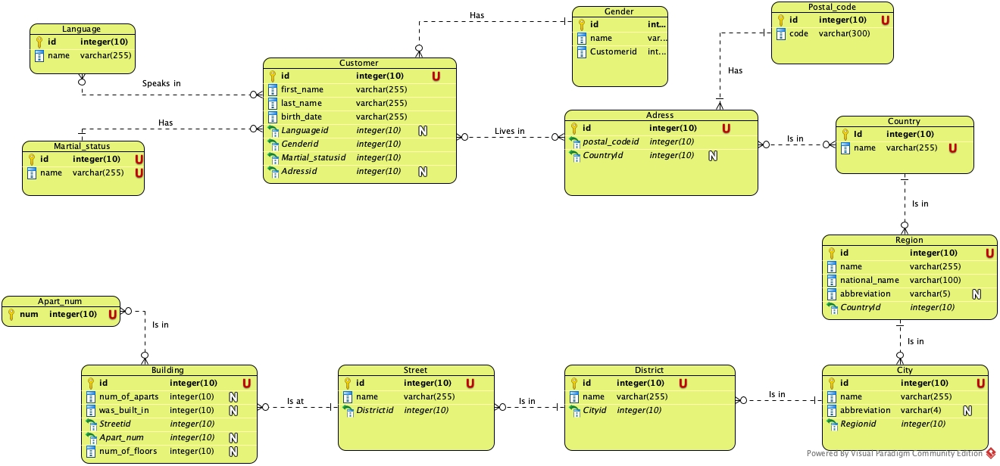

**Домашнее задание №19: Строим модель данных**

Файл some_customerts.csv представляет собой денормазивонную информацию о клиенте без строкой типизации данных. Существует лишь одна сущность - Cusomer и следующие атрибуты:

- title
- first_name
- last_name
- correspondence_language
- birth_date
- gender
- marital_status
- country
- postal_code
- region
- city
- street
- building_number

Модель данных после нормализации:

Долго думал, стоит ли заморачиваться с SDC, скажем, в примере со стасуом личной жизни(он же может меняться). Но решил оставить нулевой. И он просто будет переписываться. То же самое с полом.
По адресу было самое сложное - хотел сначала сделать адрес как составной из айдишник со ссылками на сущности городов, регионов и улиц. Но затем решил, что более удобно будет последовательно делать Страна -> Регион -> Город и тд.

Добавил атрибут аббревиатура, так как сокращения городов и регионов приняты часто и в сущности регион добавил атрибут national_name, так как называются регионы по разному даже в РФ - область, край и тд, также в мире есть провинции, штаты. 

Добавил сущность район. По дефолту можно поставить что-то типа 'без района', а так район в городе - улица в районе. 

И в сущности строение сделал атрибуты с инфой о самом строении. Мало ли, если будет анализ по покупателям в разрезе новых старых строений, многоэтажек и тд.

Номер квартиры отдельной сущностью - число, оно же PK. Не уверен, сколько максимально квартир может быть в доме, но вряд ли более тысячи.

