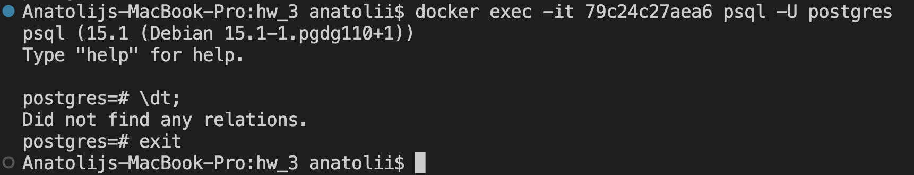
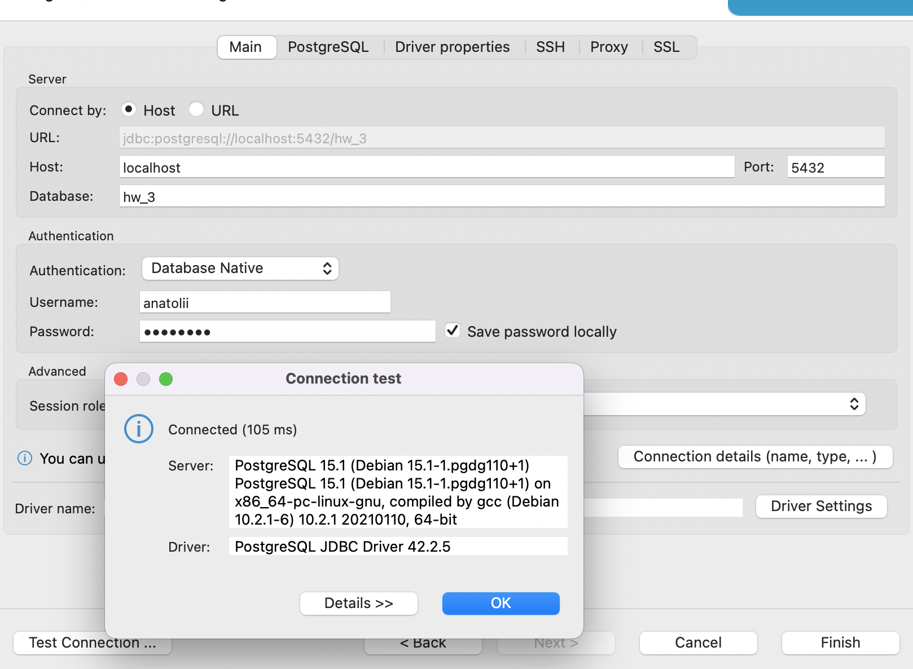
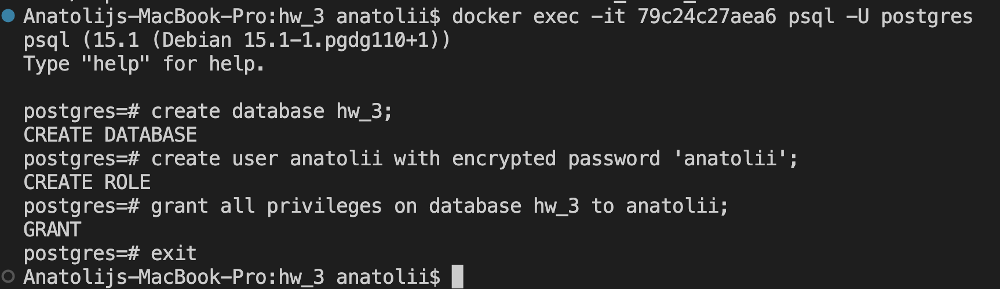

## Домашняя работа №3: Установка СУБД PostgreSQL

Создать кластер PostgreSQL в докере или на виртуальной машине, запустить сервер и подключить клиента

1. Развернуть контейнер с PostgreSQL или установить СУБД на виртуальную машину.
2. Запустить сервер.
3. Создать клиента с подключением к базе данных postgres через командную строку.
4. Подключиться к серверу используя pgAdmin или другое аналогичное приложение.

Docker-compose файл для создания БД [тут](docker-compose.yaml)
Скрины выполнения работы. 

