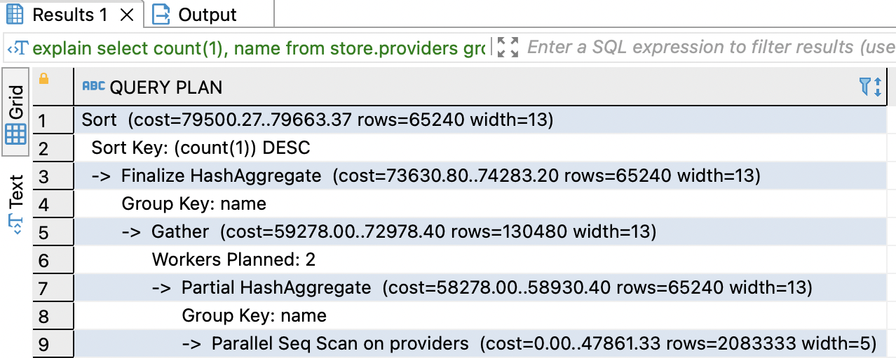
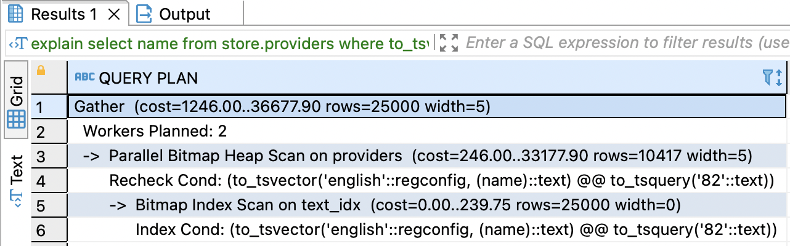
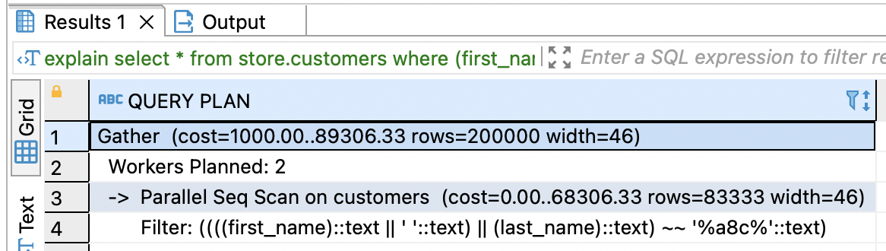
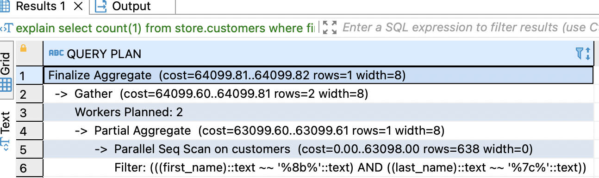

**Домашняя работа №6: Индексы PostgreSQL**


- Нагенерим данные для таблицы *providers*.

```
insert into store.providers (
    name
)
select
    left(md5(random()::text), 4)
from generate_series(1, 5000000) s(i);
```

- Создать индекс к какой-либо из таблиц вашей БД

```
create index providers_idx on store.providers(name);
```


- Прислать текстом результат команды explain, в которой используется данный индекс

```
explain select count(1), name
from store.providers
group by 2
order by 1 desc;
```


- Реализовать индекс для полнотекстового поиска

```
CREATE INDEX text_idx ON store.providers
USING GIN (to_tsvector('english',name));

explain
select name from store.providers
where to_tsvector('english',name) @@ to_tsquery('82');
```

- Реализовать индекс на часть таблицы или индекс на поле с функцией

Нагенерим данные
```
insert into store.customers (
    first_name, last_name
)
select
    left(md5(i::text), 4),
    left(md5(i::text), 4)
from generate_series(1, 5000000) s(i)
```

Создадим индекс и сделаем запрос.

```
create index partial_table_idx on store.customers ((first_name || ' ' || last_name));

explain
select *
from store.customers
where (first_name || ' ' || last_name) like '%a8c%';
```

- Создать индекс на несколько полей

```
create index full_name_idx on store.customers(first_name, last_name);

explain
select count(1)
from store.customers
where first_name like '%8b%' and last_name like '%7c%';
```

- Описать что и как делали и с какими проблемами столкнулись

С индексами и оптимизацией запросов, к сожалению, мало сталкивался в работе, хотя тема очень важная. Поэтому в основном читал документацию и гуглил. Это задание стало хорошим стартом, на новогодних праздниках думаю почитать книгу Добмровской. Говорят, для начала очень неплохо :) 