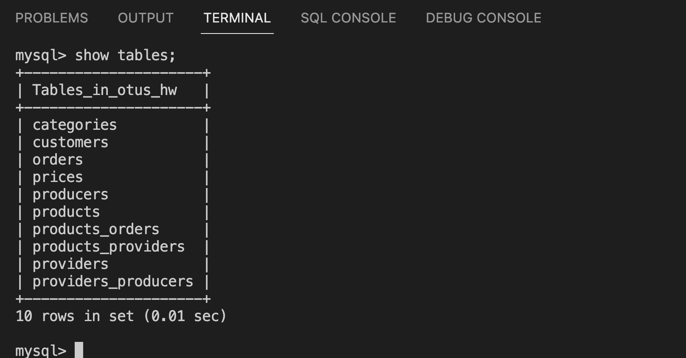

**Домашняя работа №9: Создаем базу данных MySQL в докере

Контейнер поднялся, таблицы добавились в БД. 
Скрипт создания [БД](init.sql).
В [конфиг](custom.conf/my.cnf) добавил движок и максимальное число коннектов.

